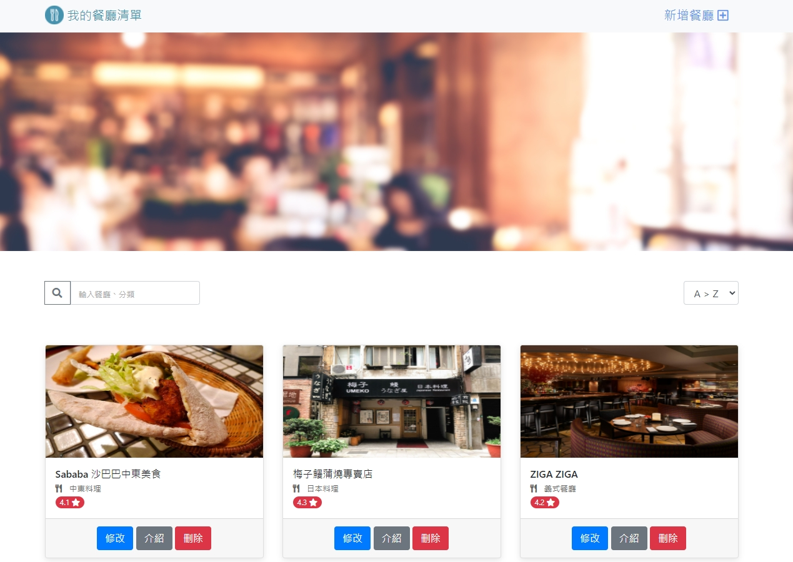

# 我的餐廳清單

### 使用者畫面


## 基本功能

* 查看所有餐廳及簡介
* 瀏覽餐廳的詳細資訊
* 搜尋特定餐廳-以餐廳名稱或類別
* 新增餐廳
* 編輯餐廳
* 刪除餐廳

## 環境設置
1.安裝 node.js 與 npm

2.將專案 clone 到本地
```
https://github.com/happygod119/-restaurant-list.git
```
3. 安裝 npm 套件

```
npm install
```
4. 執行程式

```
npm run start
```
5.若出現此行網址代表運行順利
```
Express is listening on http://localhost:3000
```

## 開發工具
* Node.js v14.16.0
* Express ^4.17.2
* Express-Handlebars ^3.0.0
* Bootstrap 4.3.1
* Font-awesome 5.8.1
* MongoDB
* mongoose 6.0.5
